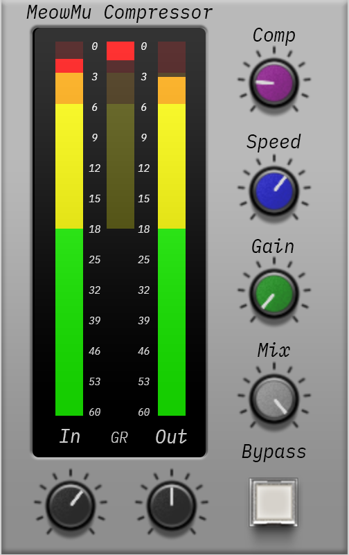

# MeowMu_Compressor_VST3
Variation of airwindows VariMu Compressor, In VST3  

What it is for: nice vocal compressor.  
After searching a bunch of other airwindows compressors, VariMu was suitable for attack time tweaking.  
muMakeupgain is bypassed.  
By multipling muAttack by 5, we can get attack time of 5ms & release time of 120ms at Speed = 0.6.  
Less the Speed -> slow attack & release.  
More the Speed -> fast attack & release.  
So, this compressor might fall somewhere between Logical4 and VariMu.  

Anyone interested, please try it and leave a feedback.  

Windows only. No Mac nor Linux campatible.  

Built for VST3, but compatible to VST2 also.

VSTSDK 3.7.7 used  
VSTGUI 4.12 used  
